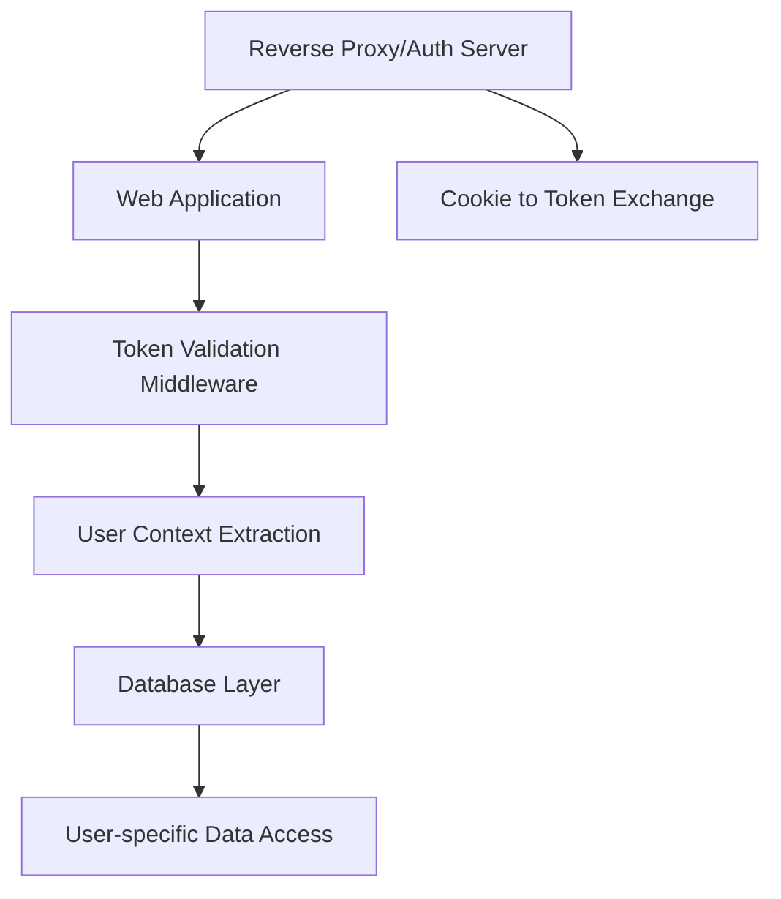
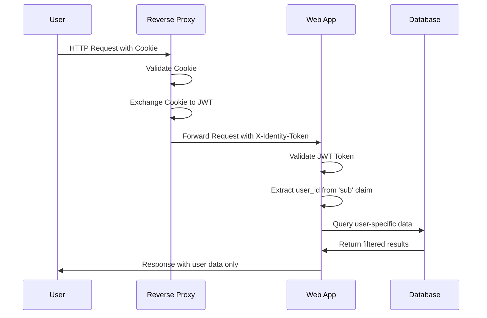
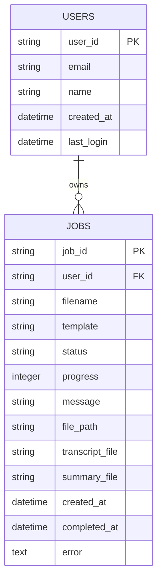

# План доработки веб-приложения: Аутентификация и авторизация пользователей

## Обзор задачи

Необходимо доработать веб-приложение для обработки встреч так, чтобы:
- Пользователи видели только свои задачи и итоговые документы
- Аутентификация осуществлялась через внешний IdP провайдер
- Identity token передавался в заголовке `X-Identity-Token`
- Идентификатор пользователя извлекался из claim `sub`
- Обмен куки на токен происходил на авторизационном сервере (reverse proxy)

## Текущее состояние

Веб-приложение [`run_web.py`](run_web.py) представляет собой Flask-приложение со следующими характеристиками:
- **Хранение задач**: В памяти (`self.processing_jobs`) - данные теряются при перезапуске
- **Аутентификация**: Отсутствует - все пользователи видят все задачи
- **Авторизация**: Отсутствует - нет разделения доступа
- **Персистентность**: Только файлы результатов в файловой системе

## Архитектура решения

### Диаграмма компонентов



### Поток аутентификации



## Структура базы данных

### ER-диаграмма



### Описание таблиц

#### Таблица USERS
- `user_id` (PK) - Идентификатор пользователя из JWT claim 'sub'
- `email` - Email пользователя (опционально)
- `name` - Имя пользователя (опционально)
- `created_at` - Дата создания записи
- `last_login` - Последний вход в систему

#### Таблица JOBS
- `job_id` (PK) - Уникальный идентификатор задачи
- `user_id` (FK) - Связь с пользователем
- `filename` - Имя загруженного файла
- `template` - Тип используемого шаблона
- `status` - Статус обработки (uploaded, processing, completed, error)
- `progress` - Прогресс выполнения (0-100)
- `message` - Текущее сообщение о статусе
- `file_path` - Путь к исходному файлу
- `transcript_file` - Путь к файлу транскрипта
- `summary_file` - Путь к файлу протокола
- `created_at` - Дата создания задачи
- `completed_at` - Дата завершения задачи
- `error` - Текст ошибки (если есть)

## Компоненты для реализации

### 1. Аутентификация и авторизация

#### `auth/token_validator.py`
- Валидация JWT токенов из заголовка `X-Identity-Token`
- Извлечение claim `sub` как идентификатора пользователя
- Обработка ошибок валидации

#### `auth/decorators.py`
- Декораторы для защиты маршрутов
- `@require_auth` - базовая аутентификация
- `@require_user_context` - с извлечением пользовательского контекста

#### `auth/jwt_utils.py`
- Утилиты для работы с JWT токенами
- Декодирование без проверки подписи (доверяем reverse proxy)
- Извлечение claims

#### `auth/user_manager.py`
- Управление пользователями
- Создание пользователя при первом входе
- Обновление информации о последнем входе

#### `auth/user_context.py`
- Контекст текущего пользователя
- Thread-local хранение пользовательской информации

### 2. База данных

#### `database/models.py`
- SQLAlchemy модели для User и Job
- Связи между таблицами
- Валидация данных

#### `database/db_manager.py`
- Менеджер базы данных
- Инициализация и миграции
- CRUD операции с фильтрацией по пользователю

#### `database/migrations/`
- Скрипты миграций базы данных
- `001_initial_schema.sql` - создание начальной схемы
- `002_add_indexes.sql` - добавление индексов для производительности

### 3. Модификация существующего кода

#### Изменения в `run_web.py`

##### Инициализация
```python
# Добавление в __init__
from auth.token_validator import TokenValidator
from auth.user_manager import UserManager
from database.db_manager import DatabaseManager

self.token_validator = TokenValidator()
self.user_manager = UserManager()
self.db_manager = DatabaseManager(config['database'])
```

##### Middleware
```python
@self.app.before_request
def authenticate_user():
    # Извлечение и валидация токена
    # Установка пользовательского контекста
```

##### Обновление маршрутов
- Все маршруты защищены аутентификацией
- Фильтрация данных по `user_id`
- Обновление операций с базой данных

## Конфигурация

### Обновление `config.json`

```json
{
  "auth": {
    "token_header": "X-Identity-Token",
    "jwt_algorithm": "RS256",
    "token_validation": {
      "verify_signature": false,
      "verify_exp": true,
      "verify_aud": false
    }
  },
  "database": {
    "type": "sqlite",
    "path": "meeting_processor.db",
    "backup_enabled": true,
    "backup_interval_hours": 24
  },
  "user_files": {
    "base_path": "web_output",
    "structure": "user_based"
  }
}
```

### Обновление `docker-compose.yml`

```yaml
services:
  meeting-web:
    # ... существующая конфигурация
    volumes:
      # ... существующие volumes
      - ./meeting_processor.db:/app/meeting_processor.db
      - ./database:/app/database
    environment:
      # ... существующие переменные
      - AUTH_TOKEN_HEADER=X-Identity-Token
```

## Безопасность

### Валидация токенов
- Проверка формата JWT
- Извлечение claim `sub` как идентификатора пользователя
- Обработка ошибок валидации
- Логирование попыток доступа

### Изоляция данных
- Все запросы к базе данных фильтруются по `user_id`
- Файлы организованы в пользовательские директории: `web_output/{user_id}/`
- Проверка доступа к файлам перед отдачей

### Структура файлов
```
web_output/
├── user_123/
│   ├── job_abc/
│   │   ├── transcript.txt
│   │   └── summary.md
│   └── job_def/
└── user_456/
    └── job_ghi/
```

## Миграция данных

### Стратегия миграции
1. Создание схемы базы данных
2. Перенос существующих задач в таблицу с `user_id = 'legacy'`
3. Реорганизация файловой структуры
4. Обратная совместимость для существующих задач

### Скрипт миграции
```python
def migrate_existing_jobs():
    # Создание legacy пользователя
    # Перенос задач из памяти в базу данных
    # Перемещение файлов в пользовательские директории
```

## Мониторинг и логирование

### Расширение логирования
- Логирование аутентификации
- Аудит доступа к данным
- Метрики по пользователям
- Ошибки валидации токенов

### Метрики
- Количество активных пользователей
- Статистика по задачам на пользователя
- Производительность аутентификации

## Тестирование

### Тестовые сценарии
1. **Аутентификация**:
   - Валидный токен → успешный доступ
   - Невалидный токен → ошибка 401
   - Отсутствующий токен → ошибка 401

2. **Изоляция данных**:
   - Пользователь A не видит задачи пользователя B
   - Попытка доступа к чужим файлам → ошибка 403

3. **Функциональность**:
   - Загрузка файлов работает с аутентификацией
   - Обработка задач привязана к пользователю
   - Скачивание результатов доступно только владельцу

## Приоритеты реализации

### Этап 1 (Высокий приоритет)
1. **База данных**:
   - Создание моделей и схемы
   - Менеджер базы данных
   - Миграции

2. **Аутентификация**:
   - Token validator
   - Middleware для Flask
   - Декораторы защиты маршрутов

3. **Изоляция данных**:
   - Фильтрация по user_id
   - Пользовательские директории
   - Обновление всех маршрутов

### Этап 2 (Средний приоритет)
1. **Миграция данных**:
   - Скрипт переноса существующих задач
   - Реорганизация файловой структуры

2. **Расширенное логирование**:
   - Аудит доступа
   - Метрики пользователей

3. **Docker конфигурация**:
   - Обновление docker-compose.yml
   - Переменные окружения

### Этап 3 (Низкий приоритет)
1. **Оптимизация**:
   - Кэширование пользовательских данных
   - Индексы базы данных

2. **Дополнительная безопасность**:
   - Rate limiting по пользователям
   - Расширенная валидация токенов

3. **Мониторинг**:
   - Health checks с учетом аутентификации
   - Дашборд метрик

## Результат

После реализации плана:
- ✅ Каждый пользователь видит только свои задачи
- ✅ Аутентификация через внешний IdP
- ✅ Полная изоляция пользовательских данных
- ✅ Сохранение всей существующей функциональности
- ✅ Масштабируемая архитектура
- ✅ Безопасное хранение данных

Веб-приложение будет полностью соответствовать требованиям многопользовательской системы с внешней аутентификацией.